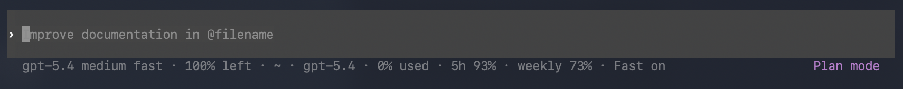

# Powerbar

Powerbar turns the Codex CLI footer into an operational HUD.

It keeps the session state you actually care about in the line you already watch: model, reasoning mode, context usage, 5h and 7d limits, Git state, approvals, current plan step, and live tool activity.


## Default vs Powerbar

Before:



After:


## Why Powerbar

Codex's built-in footer is intentionally minimal. That works for short prompts. It gets thin once the session is doing real work across multiple turns, tools, files, and rate windows.

Powerbar exists to make long Codex sessions legible without opening another pane or switching to a dashboard.

- footer-first: no sidecar UI, no browser tab, no tmux dependency
- session-aware: merges live footer env data with rollout JSONL history
- operational: surfaces reset times, plan progress, tool buckets, sandbox and approval state
- installable: patched `codex` binary plus `status_line_command` wiring in one flow

## What You See

- active model, reasoning effort, fast mode, and CLI version
- current project plus Git branch and dirty or ahead or behind indicators
- context usage in percent and tokens
- 5h and 7d usage windows with concrete reset times when available
- approval policy, sandbox mode, agent count, and MCP count
- current plan step plus recent or active tool activity

## Quick Start

```bash
git clone https://github.com/Qifei-C/codex-powerbar.git
cd codex-powerbar/powerbar
./install.sh
```

Notes:

- `./install.sh` is the guided flow
- `./install.sh --full` is the one-shot install path
- `./install.sh --source` forces a source build of patched `codex`
- the installer refuses to run while any `codex` process is active

## Platform Support

Prebuilt patched binaries are published for:

- macOS Apple Silicon: `codex-darwin-arm64.tar.gz`
- Linux x86_64: `codex-linux-x86_64.tar.gz`

Source-build fallback covers:

- Intel macOS
- environments where prebuilt assets are unavailable but Rust and build dependencies are present

Windows is not a primary target.

## Repository Layout

- `powerbar/`: runnable HUD, installer, tests, docs, and patch files
- `.github/workflows/build-codex.yml`: patched `codex` release workflow
- `powerbar/patches/codex-statusline-command.patch`: Codex patch that enables `status_line_command`

The repository root owns CI and release automation. The product itself lives under `powerbar/`.

## Read Next

- user and developer guide: `powerbar/README.md`
- installer entry point: `powerbar/install.sh`
- parser and renderer sources: `powerbar/src/`
- tests: `powerbar/tests/`

## Release Model

- `master` pushes run lightweight HUD CI
- patched binary builds on `master` only run when the binary workflow, patch set, or installer changes
- `workflow_dispatch` refreshes the rolling `latest` pre-release
- `codex-v*` tags create patched Codex binary releases
- `v*` tags are used for Powerbar product releases
