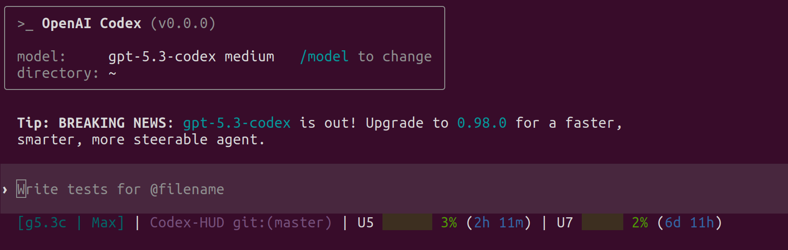

# Powerbar

Powerbar is a HUD for Codex CLI. It is built for the footer/status-line use case: keep the high-value state visible without leaving the terminal.

It combines:

- Codex status-line env data for the most current usage percentages
- rollout JSONL parsing for richer session context, tool history, plan content, and reset-time backfill
- a patched `codex` binary plus `status_line_command` wiring so the HUD is always present in active sessions



## What The HUD Shows

- active model and reasoning effort
- current project and Git branch
- context usage and context window size
- 5-hour and 7-day usage windows, with reset time when available
- current plan step
- recent / active tool activity summarized into buckets like `Read`, `Edit`, `Grep`, `Bash`
- approval mode, sandbox mode, and selected environment details
- compact count, feature badges, and optional session metadata

The current expanded layout is optimized for the Codex footer constraint:

1. header
2. context + rate windows
3. environment
4. `plan | tools`

## How Data Priority Works

Powerbar does not trust a single source blindly.

- usage percentages come from live Codex env vars when present
- reset times and rate window lengths are merged field-by-field so rollout data can fill gaps when env only provides percentages
- plan text comes from rollout when env only exposes plan counts
- tool summaries come from rollout events

This is deliberate: the merged snapshot is more accurate than rollout-only, and more complete than env-only.

## Install

### Guided install

```bash
./install.sh
```

This is the default interactive flow.

### Non-interactive install

```bash
./install.sh --full
```

### Force source build

```bash
./install.sh --source
```

### Faster source build

```bash
./install.sh --source --fast
```

### Uninstall

```bash
./install.sh --uninstall
```

## What The Installer Does

`install.sh` is responsible for the full local setup:

- builds the HUD with `npm ci` and `npm run build`
- installs the runtime to `~/.powerbar/dist`
- configures `~/.codex/config.toml` with `status_line_command`
- installs a patched `codex` binary to `~/.local/bin/codex`
- prefers a GitHub prebuilt binary when one exists for the platform
- falls back to source build when prebuilt assets are unavailable

## Supported Platforms

### Prebuilt patched binaries

- macOS Apple Silicon (`codex-darwin-arm64.tar.gz`)
- Linux x86_64 (`codex-linux-x86_64.tar.gz`)

### Source-build fallback

- Intel macOS
- any environment where prebuilt assets are unavailable but Rust and build dependencies are present

### Not a primary target

- Windows

## Verify The Install

Start a fresh shell or a fresh Codex session after install, then run:

```bash
command -v codex
codex --version
grep -n "status_line_command" ~/.codex/config.toml
node ~/.powerbar/dist/index.js --status-line --once --no-clear --cwd "$PWD"
```

Powerbar also ships a self-check:

```bash
node dist/index.js --self-check
```

## Runtime Commands

From `powerbar/`:

```bash
npm run build
npm run dev
npm test
node dist/index.js --once
node dist/index.js --status-line --once --no-clear --cwd "$PWD"
node dist/index.js --overview
node dist/index.js --self-check
```

## Configuration

Optional runtime config lives at:

```text
~/.powerbar/config.json
```

Example:

```json
{
  "preset": "essential",
  "lineLayout": "expanded",
  "refreshMs": 700,
  "pathLevels": 2,
  "showTools": true,
  "showPlan": true,
  "showEnvironment": true,
  "showGitAheadBehind": true,
  "showGitFileStats": false,
  "contextDisplay": "both",
  "sevenDayThreshold": 60
}
```

### Presets

- `minimal`: compact, one-line, no detail rows
- `essential`: default balance for daily use
- `full`: richer expanded layout, more detail rows, lower 7-day display threshold

### Important knobs

- `lineLayout`: `compact` or `expanded`
- `showTools`: enable tool summary row content
- `showPlan`: enable plan row content
- `showEnvironment`: show approval/sandbox/environment info
- `contextDisplay`: `percent`, `tokens`, `both`, or `remaining`
- `sevenDayThreshold`: controls when the 7-day bar appears in tighter layouts

## Codex Integration

The installer writes a `status_line_command` entry into `~/.codex/config.toml`.

Powerbar also respects Codex-provided status-line item filtering through:

```text
CODEX_STATUS_LINE_ITEMS
```

That means Codex-native footer selection still works, while Powerbar keeps HUD-only extras such as plan and tool summaries.

## Release And Build Workflow

The repository root owns CI and release automation.

- `master` pushes run lightweight HUD CI through `../.github/workflows/hud-tests.yml`
- patched binary builds on `master` only run when `../.github/workflows/build-codex.yml`, `patches/`, or `install.sh` change
- `workflow_dispatch` refreshes the rolling `latest` pre-release explicitly
- `codex-v*` tags produce versioned releases

The current workflow publishes:

- `codex-darwin-arm64.tar.gz`
- `codex-linux-x86_64.tar.gz`

## Repository Layout

- `src/`: parser, merger, renderer, overview, self-check
- `tests/`: Node test suite
- `scripts/`: config and patch helper scripts
- `patches/`: Codex patch set
- `docs/`: screenshots, analysis, launch copy
- `install.sh`: installer / updater / uninstall entry point

## Troubleshooting

### HUD does not appear

- confirm `status_line_command` exists in `~/.codex/config.toml`
- restart Codex; existing sessions do not pick up footer changes
- run `node ~/.powerbar/dist/index.js --status-line --once --no-clear --cwd "$PWD"` manually

### Usage percentages look stale

- Powerbar prefers live env percentages, so stale values usually mean the session itself is not exporting fresh status-line data
- verify you are on a patched `codex` from `~/.local/bin/codex`

### Reset time is missing

- this means neither env nor rollout provided a usable reset timestamp for that window
- Powerbar will still show the window length as a fallback

### Tool summaries are missing

- tool summaries come from rollout events, not just env counters
- make sure the active session is writing rollout JSONL and that Powerbar is resolving the correct session

### Intel macOS install downloads fail

- expected: Intel macOS no longer has a prebuilt release asset
- use `./install.sh --source`

## Contributing

Before pushing changes:

```bash
npm test
```

If the change affects the patched binary or install flow, also verify:

```bash
./install.sh --full
```

Issues and PRs belong in:

- `https://github.com/Qifei-C/codex-powerbar/issues`
