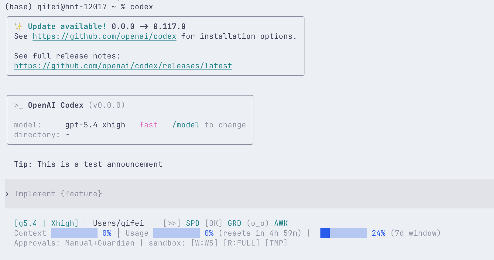
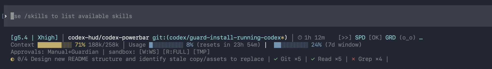
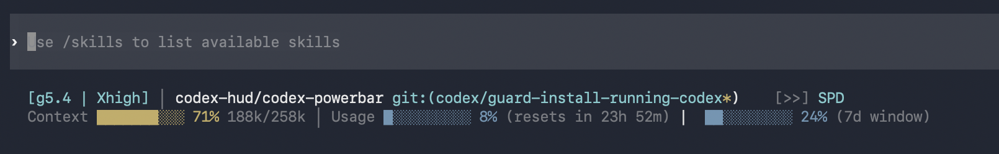

# Powerbar

Powerbar is a footer HUD for Codex CLI.

It is built around the `status_line_command` path: keep the high-signal session state visible in the footer, with enough density to be useful during long coding sessions.



## What It Is

Powerbar combines three things:

- a patched `codex` binary that can execute an external status-line command
- a Node and TypeScript HUD renderer installed at `~/.powerbar/dist`
- a field-by-field merge between live Codex env data and rollout JSONL session history

The result is a footer that stays lightweight but carries much more operational detail than the default Codex footer.

## What The HUD Shows

- model, reasoning effort, fast mode, and optional CLI version
- current project and Git branch, with dirty or ahead or behind indicators
- context usage in percent and tokens
- 5-hour and 7-day rate windows, with concrete reset times when available
- approval policy, sandbox mode, collaboration details, and environment badges
- current plan step plus recent and active tool work

## Real Terminal Captures

Footer density in a real session:



Less-detail view with a tighter footer:



## Footer Anatomy

The current expanded layout is designed around four rows:

1. header
2. context plus rate windows
3. environment
4. `plan | tools`

Typical output looks like:

```text
[g5.4 | High | SPD] | codex-hud/codex-powerbar git:(master* ↑2)
Context 55% 141k/258k | Usage 6% (resets 6:52 PM) | U7 24% (resets Thu 9:55 PM)
Approvals: Manual | Sandbox: workspace-write | Agents: 0 | MCP: 0
◐ 1/3 Fix weekly reset fallback | ✓ Read x7 | ✓ Edit x5 | ✓ Bash x4
```

The compact preset compresses the same data into a single status line when space is tight.

## Install

Before running the installer, quit all active `codex` sessions. The installer refuses to mutate the binary or config while Codex is running.

### Guided install

```bash
./install.sh
```

### Non-interactive install

```bash
./install.sh --full
```

### Force source build

```bash
./install.sh --source
```

### Faster source build

```bash
./install.sh --source --fast
```

### Uninstall

```bash
./install.sh --uninstall
```

## What The Installer Does

`install.sh` performs the full local setup:

- builds the HUD with `npm ci` and `npm run build`
- installs the runtime to `~/.powerbar/dist`
- writes `status_line_command` into `~/.codex/config.toml`
- installs a patched `codex` binary
- prefers a GitHub prebuilt binary when one exists for the platform
- falls back to source build when prebuilt assets are unavailable

## Supported Platforms

### Prebuilt patched binaries

- macOS Apple Silicon: `codex-darwin-arm64.tar.gz`
- Linux x86_64: `codex-linux-x86_64.tar.gz`

### Source-build fallback

- Intel macOS
- any environment where prebuilt assets are unavailable but Rust and build dependencies are present

### Not a primary target

- Windows

## Verify The Install

Start a fresh shell or a fresh Codex session after install, then run:

```bash
command -v codex
codex --version
grep -n "status_line_command" ~/.codex/config.toml
node ~/.powerbar/dist/index.js --status-line --once --no-clear --cwd "$PWD"
```

Powerbar also ships a self-check:

```bash
node dist/index.js --self-check
```

## Runtime Commands

From `powerbar/`:

```bash
npm run build
npm run dev
npm test
node dist/index.js --once
node dist/index.js --status-line --once --no-clear --cwd "$PWD"
node dist/index.js --overview
node dist/index.js --self-check
```

## Configuration

Optional runtime config lives at:

```text
~/.powerbar/config.json
```

Example:

```json
{
  "preset": "essential",
  "lineLayout": "expanded",
  "refreshMs": 700,
  "pathLevels": 2,
  "showTools": true,
  "showPlan": true,
  "showEnvironment": true,
  "showGitAheadBehind": true,
  "showGitFileStats": false,
  "contextDisplay": "both",
  "sevenDayThreshold": 60
}
```

### Presets

- `minimal`: compact, one-line, no detail rows
- `essential`: default balance for daily use
- `full`: richer expanded layout, more detail rows, lower 7-day display threshold

### Important knobs

- `lineLayout`: `compact` or `expanded`
- `showTools`: enable tool summary row content
- `showPlan`: enable plan row content
- `showEnvironment`: show approval and sandbox and environment info
- `contextDisplay`: `percent`, `tokens`, `both`, or `remaining`
- `sevenDayThreshold`: controls when the 7-day bar appears in tighter layouts

## Codex Integration

The installer writes a `status_line_command` entry into `~/.codex/config.toml`.

Powerbar also respects Codex-provided footer item filtering through:

```text
CODEX_STATUS_LINE_ITEMS
```

Codex-native item selection still works. Powerbar keeps HUD-only additions such as plan and tool summaries around those native selections.

## Troubleshooting

### HUD does not appear

- confirm `status_line_command` exists in `~/.codex/config.toml`
- restart Codex; existing sessions do not pick up footer changes
- run `node ~/.powerbar/dist/index.js --status-line --once --no-clear --cwd "$PWD"` manually

### Usage percentages look stale

- Powerbar prefers live env percentages, so stale values usually mean the session itself is not exporting fresh footer env data
- verify you are on a patched `codex` from `~/.local/bin/codex`

### Reset time is missing

- this means neither env nor rollout provided a usable reset timestamp for that window
- Powerbar falls back to showing the raw window length instead of inventing a time

### Tool summaries are missing

- tool summaries come from rollout events, not just env counters
- confirm the active session is writing rollout JSONL and that Powerbar resolved the correct session id

### Intel macOS install downloads fail

- expected: Intel macOS no longer has a prebuilt release asset
- use `./install.sh --source`

## Repository Layout

- `src/`: parser, merger, renderer, overview, self-check
- `tests/`: Node test suite
- `scripts/`: config and patch helper scripts
- `patches/`: Codex patch set
- `docs/`: screenshots, diagrams, launch copy
- `install.sh`: installer and updater and uninstall entry point

## Contributing

Before pushing changes:

```bash
npm test
```

If the change affects the patched binary or install flow, also verify:

```bash
./install.sh --full
```

Issues and PRs belong in:

- `https://github.com/Qifei-C/codex-powerbar/issues`
